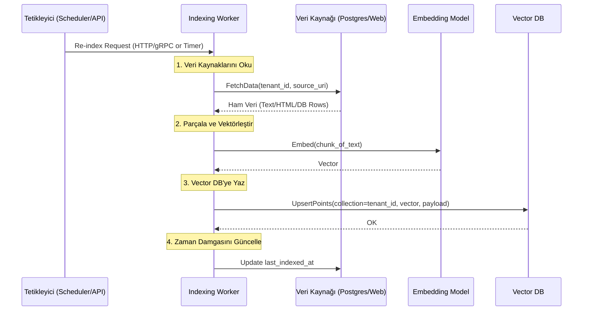

# ✍️ Sentiric Knowledge Indexing Service - Mantık ve Akış Mimarisi

**Stratejik Rol:** RAG mimarisinin "Yazma" (Indexing) bacağını temsil eder. Harici veri kaynaklarından (PostgreSQL, Web Siteleri, Dosyalar) gelen yapılandırılmış veya yapılandırılmamış veriyi işler, parçalar (chunking), vektörleştirir ve Vector Database'e (Qdrant) yazar.

---

## 1. CQRS Mimarisi ve Yazma Akışı

Bu servis, olay tabanlı veya periyodik olarak çalışan bir arka plan işçisidir (worker). Yönetim ve tetikleme için HTTP ve gRPC arayüzleri sunar.

## 2. Protokoller ve Sorumluluklar

*   **HTTP (Port 17030):**
    *   `/health`: Canlılık (liveness) ve hazır olma (readiness) durumunu kontrol etmek için kullanılır. Bağımlılıklar (Postgres, Qdrant, Model) hazır olmadan `503` döner.
    *   `/reindex`: REST API üzerinden manuel tetikleme sağlar.

*   **gRPC (Port 17031):**
    *   `TriggerReindex` RPC: Diğer mikroservislerin veya otomasyon araçlarının programatik olarak indeksleme başlatmasını sağlar. Özellikle CI/CD pipeline'ları veya `agent-service` gibi servisler için yüksek performanslı bir arayüzdür.

*   **Metrics (Port 17032):**
    *   `/metrics`: Prometheus uyumlu metrikler sunar. Bu metrikler şunları içerir:
        *   `indexing_cycle_duration_seconds`: Bir tam indeksleme döngüsünün ne kadar sürdüğü.
        *   `datasources_processed_total`: İşlenen veri kaynağı sayısı (başarılı/başarısız).
        *   `vectors_upserted_total`: Qdrant'a yazılan toplam vektör sayısı.
        *   `last_indexing_timestamp_seconds`: Son başarılı indekslemenin zaman damgası.

Bu güncellemelerle birlikte, her iki `knowledge` servisi de artık hem modern iletişim protokollerini destekliyor hem de operasyonel olarak tam izlenebilir hale gelmiş durumda.