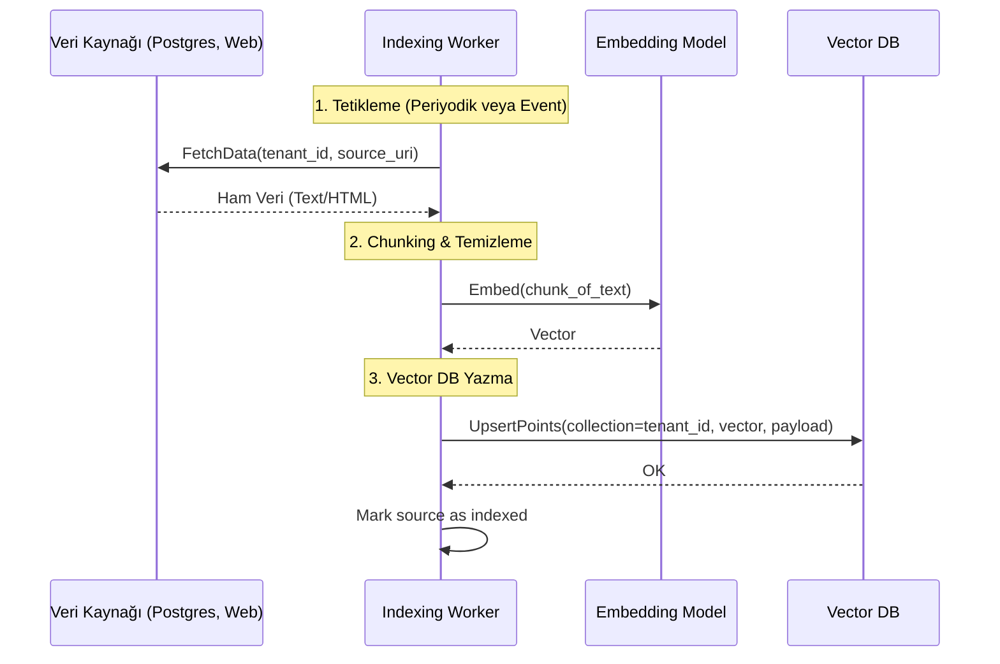

# ✍️ Sentiric Knowledge Indexing Service - Mantık ve Akış Mimarisi

**Stratejik Rol:** RAG mimarisinin "Yazma" (Indexing) bacağını temsil eder. Harici veri kaynaklarından (PostgreSQL, Web Siteleri, Dosyalar) gelen yapılandırılmış veya yapılandırılmamış veriyi işler, parçalar (chunking), vektörleştirir ve Vector Database'e (Qdrant) yazar.

---

## 1. CQRS Mimarisi ve Yazma Akışı

Bu servis, olay tabanlı veya periyodik olarak çalışır.

## 2. Ana İşleyiciler (Ingesters)
*Indexing Service, farklı veri kaynaklarını işlemek için modüler ingester'lar kullanır:
* postgres_ingester.py: PostgreSQL tablolarını okur.
* web_ingester.py: URL'leri (örneğin kurumsal FAQ sayfaları) okur ve ayrıştırır.